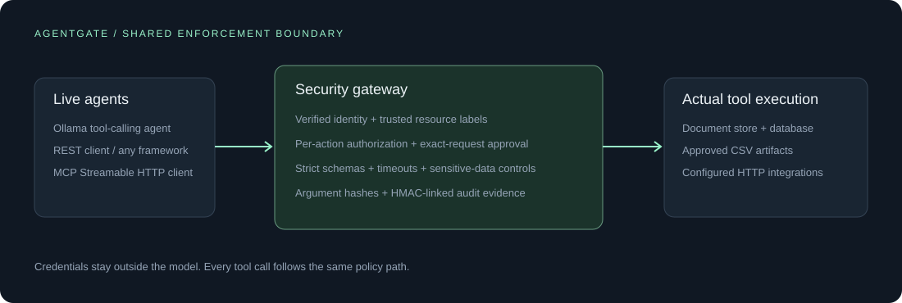

# AgentGate

**Per-action access control for live AI agents.** AgentGate sits between an agent and its tools, verifies its identity, authorizes the requested resource, enforces approval for consequential actions, redacts supported sensitive patterns, and records the decision.

The same boundary powers a web console, a REST tool API, and a standards-based MCP server. The included assistant uses a real local Ollama model with multi-step tool calling. No API key is required for the default setup.



## What works

- **Live agent execution:** streamed planning progress, actual tool calls, tool results, and a model-generated answer. Bounded steps, timeouts, cancellation, and model concurrency.
- **Identity-bound authorization:** high-entropy per-agent credentials stored as SHA-256 hashes; tenant and role come from the server. Revocation and current policy are checked for each tool action.
- **Resource isolation:** searches filter trusted tenant/classification metadata before returning results. Direct reads and dataset queries enforce the same boundary. Caller-supplied roles or tenants are rejected.
- **Real tools:** stored document search/read, parameterized database queries, downloadable CSV exports, and operator-configured HTTP integrations. Import your own documents through the CLI.
- **Human approvals:** 10-minute, single-use approval tickets bound to the exact normalized request and requesting identity. Approval never overrides a resource denial.
- **Data protection:** recursive redaction of supported email, US SSN, and selected API-key patterns on tool output and model input/output. Model text is buffered before presentation to prevent leaking patterns split across streaming chunks.
- **Evidence:** live audit events with argument hashes, decisions, policy versions, redaction counts, and timing; an HMAC-linked chain verifier.
- **Operational controls:** persistent request-rate limits, bounded request/response sizes, strict schemas, fixed connector destinations, rejected redirects, and localhost host/origin checks.

The bundled documents and records are **synthetic fixtures**. The tools execute actual database and file operations; the agent is not a canned response generator. Configured connectors execute real HTTP requests. See [security boundaries and limitations](docs/SECURITY.md).

## Quick start · Windows

Run these commands from this directory with Python 3.11 or newer:

```powershell
python -m venv .venv
.\.venv\Scripts\python.exe -m pip install -r requirements.lock
.\.venv\Scripts\python.exe -m pip install -e ".[dev]"
.\.venv\Scripts\agentgate.exe init
```

Set up the free local model. If Ollama is already installed:

```powershell
ollama pull qwen3:1.7b
```

Otherwise, the included script downloads a checksum-verified portable runtime and starts it locally:

```powershell
powershell -ExecutionPolicy Bypass -File scripts/local_model.ps1
```

The runtime archive is about 1.4 GB; the model download is about 1.4 GB. Allow additional space for extraction. Downloads remain in `.runtime/`, which is excluded from Git. CPU inference works, but performance depends on available RAM and background applications. The runtime starts in a hidden window and binds to `127.0.0.1:11434`; it is not installed as a system service.

Start the gateway:

```powershell
.\.venv\Scripts\agentgate.exe doctor
.\.venv\Scripts\agentgate.exe serve
```

Open **http://127.0.0.1:8000**. In a second terminal, get the support credential:

```powershell
.\.venv\Scripts\agentgate.exe credentials --role support
```

Paste that credential into the dashboard. It stays in browser memory and is cleared when you disconnect. Use `--role admin` in a separate browser session to review approvals or manage identities. Initial plaintext credentials are kept in the Git-ignored `data/credentials.json` for local setup; the database stores token hashes. Do not publish this file.

Try: **“Find the support escalation guide and summarize the process.”**

Linux/macOS: activate `.venv`, run `pip install -e '.[dev]'`, install Ollama using its official instructions, and run `agentgate init`, `ollama pull qwen3:1.7b`, and `agentgate serve`.

## Demo workflows

| Workflow | Expected result with a support credential |
|---|---|
| Search for the support escalation guide | Authorized search and redacted result |
| Query payroll | Denied before dataset execution |
| Read `other-tenant` | Denied without revealing that document's contents |
| Read `injected-guide` | Untrusted text reaches the model; any attempted payroll action remains denied |
| Export 5 ticket rows | An approval request appears; no CSV exists yet |
| Admin approves; retry exact request with its approval ID | CSV created; credential-bound download succeeds |
| Replay the consumed approval | Denied |
| Revoke the agent credential | Subsequent requests and tool actions fail authentication/authorization |

The live model may refuse an injected instruction itself. Use the Tool Lab to demonstrate the independent enforcement boundary even if the model does not attempt the attack. Do not describe refusal as a gateway block without an actual denied tool event.

## Real agent integrations

### REST · any agent framework

Expose the tool schemas from `GET /api/tools` to your agent. Send its chosen tool to `POST /api/tools/invoke` with a credential issued to that agent. Do not give the model the credential or a direct backend connection.

```python
response = await client.post(
    "http://127.0.0.1:8000/api/tools/invoke",
    headers={"Authorization": f"Bearer {agent_token}"},
    json={"tool": "query_records", "arguments": {"dataset": "tickets", "limit": 5}},
)
result = response.json()
```

Responses distinguish `allow`, `deny`, and `approval_required`. A denial contains no tool result. Native tools and external integrations share the same gateway. See [examples/rest_client.py](examples/rest_client.py).

### MCP · Streamable HTTP

Configure your MCP-capable agent with:

```json
{
  "url": "http://127.0.0.1:8000/mcp/",
  "headers": {"Authorization": "Bearer <credential-kept-outside-the-model>"}
}
```

Header configuration syntax varies by client. AgentGate uses the official Python MCP SDK and supports initialization, tool discovery, and calls over stateless Streamable HTTP. `GET` event streams at the MCP endpoint are optional in this transport; the application also provides a separate authenticated audit stream. The example uses a real MCP SDK client:

```powershell
$env:AGENTGATE_TOKEN = (& .\.venv\Scripts\agentgate.exe credentials --role support)
.\.venv\Scripts\python.exe examples/mcp_client.py
```

MCP tools: `search_documents`, `read_document`, `query_records`, `export_report`, and `invoke_connector`. The latter two accept `approval_id` for retrying an approved request.

### External HTTP tools

Edit `data/connectors.yaml` and restart the server. Register a fixed endpoint, tenant, allowed roles, strict JSON Schema, and approval requirement. The model can choose only the registered connector/operation and schema-valid payload; it cannot provide the destination URL, method, or authorization header. Service credentials are resolved from environment variables on the gateway.

```yaml
connectors:
  helpdesk:
    tenant: acme
    roles: [support, admin]
    operations:
      create_ticket:
        url: https://your-helpdesk.example/api/tickets
        method: POST
        approval: true
        credential_env: HELPDESK_API_KEY
        schema:
          type: object
          additionalProperties: false
          required: [title]
          properties:
            title: {type: string, minLength: 1, maxLength: 200}
```

Use narrow operations. Do not register a general-purpose proxy or shell endpoint. Integration tests exercise an actual local HTTP upstream with payload inspection, role checks, and redaction.

### Import your own documents

```powershell
.\.venv\Scripts\agentgate.exe ingest .\company-guide.md --id company-guide --tenant acme --classification support
```

Documents must be UTF-8 text/Markdown and no larger than 256 KiB. The operator sets authoritative labels; the model does not. Use `agentgate init --no-seed` for a fresh installation without bundled documents or records.

## Configuration

Copy `.env.example` to `.env` if you need overrides. The CLI loads it without replacing existing environment variables. The default provider is `ollama`. The optional `compatible` provider accepts a configurable chat-completions endpoint and model; a provider that requires credentials also requires `AGENTGATE_MODEL_KEY`. The default local route makes no cloud inference calls.

`AGENTGATE_REQUESTS_PER_MINUTE` applies to each identity's tool calls and agent-run admission. `AGENTGATE_ALLOWED_ORIGINS` controls browser-origin access. The dashboard and API use the same origin; permissive CORS is not enabled. Run one application worker for this SQLite-backed edition.

## Verification and evaluation

```powershell
.\.venv\Scripts\python.exe -m pytest -q
.\.venv\Scripts\python.exe -m ruff check src tests examples
.\.venv\Scripts\agentgate.exe benchmark --output artifacts/evaluation.json
.\.venv\Scripts\agentgate.exe verify-audit
```

The benchmark creates a disposable database and evaluates **64 forced tool calls across 10 scenario families**: 32 unauthorized actions and 32 permitted reads. Parameter variations account for multiple cases within a family. The unsafe reference directly calls the executor with authorization removed; it is inaccessible through REST and MCP. This measures enforcement under attempted misuse, **not LLM prompt-injection attack success**. See [evaluation methodology](docs/EVALUATION.md).

Run the real-model smoke suite after starting Ollama:

```powershell
.\.venv\Scripts\python.exe scripts/verify_live.py
```

It uses the configured real provider, saves a redacted transcript, and checks an authorized query, a prohibited query, and an approval request. Model behavior is reported separately from the deterministic gateway benchmark.

## Docker

```powershell
docker compose up --build
docker compose exec agentgate agentgate credentials --role support
```

The container runs as an unprivileged user and stores data in a named volume. The published port binds only to localhost. On Windows/macOS Docker Desktop, the model URL points to host Ollama. Ollama must be reachable from the container; its default loopback binding can prevent that. Native Python is the default supported local path. For an isolated Docker model deployment, run an Ollama service on the same private Docker network and point `AGENTGATE_MODEL_URL` at that service. Do not expose the model port publicly.

The container build and REST/MCP/security workflow have been verified on Docker Desktop. A running container can be checked with `python scripts/verify_container.py --container <name> --url http://127.0.0.1:<port>`. The script reads bootstrap credentials inside the container without displaying them. Add `--with-model` to require a live model-driven task; the host must have sufficient free memory for inference as well as Docker. CI also builds the image and runs the container smoke check. See [verification results](docs/VERIFICATION.md) and [security guidance](docs/SECURITY.md).

## Submission archive

Run `python scripts/package.py` to generate `artifacts/AgentGate-source.zip`. The archive contains source, documentation, tests, and selected verification artifacts. It excludes credentials, `.env`, runtime databases, downloaded models, and the virtual environment. Publish the contents of this project directory as the repository root so the included CI workflow runs correctly.

For the background server started during development, `scripts/stop.ps1` stops only the recorded AgentGate process after verifying its executable and command. Foreground servers stop with Ctrl+C. Keep Ollama running while using the live assistant.

## Repository layout

```text
src/agentgate/    gateway, policy models, storage, REST, MCP, live agent, dashboard
tests/           security invariants, concurrent approval replay, live HTTP/MCP integration
examples/        framework-independent REST and MCP clients
scripts/         portable local-model setup and real-model verification
docs/            architecture, threat model, evaluation, and interview/demo guidance
artifacts/       generated benchmark and live-model reports
```

## Project context

This is an independent portfolio project inspired by the problem of securing agent tool access. It is not affiliated with Zscaler and does not claim to reproduce its platform. Its emphasis is practical least privilege, deterministic execution controls, and inspectable evidence.

License: MIT.

